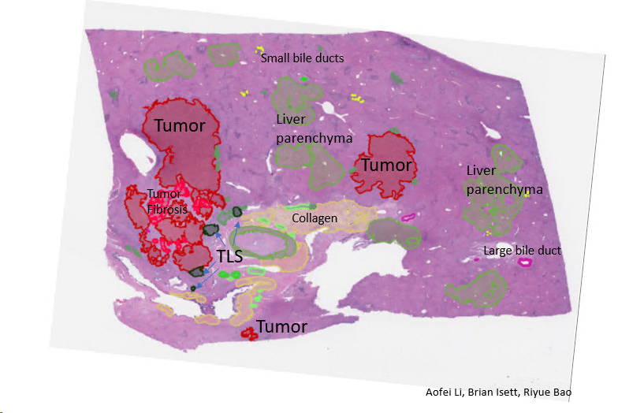
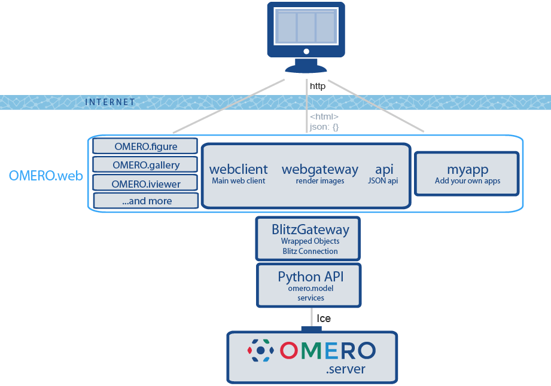
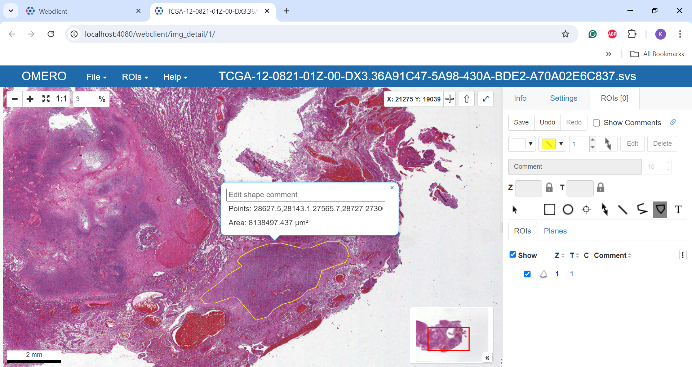
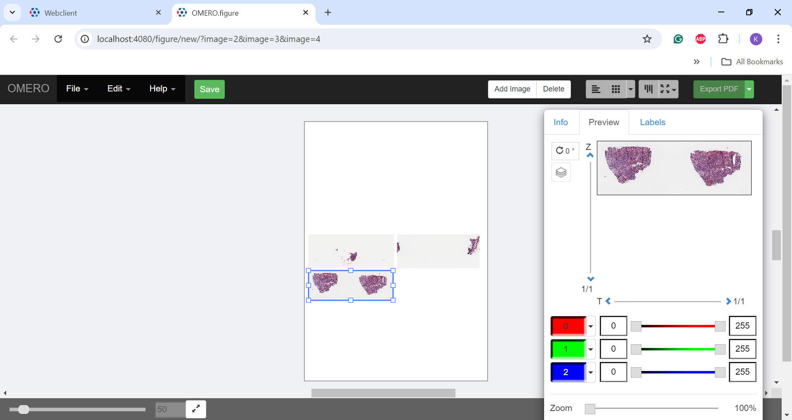
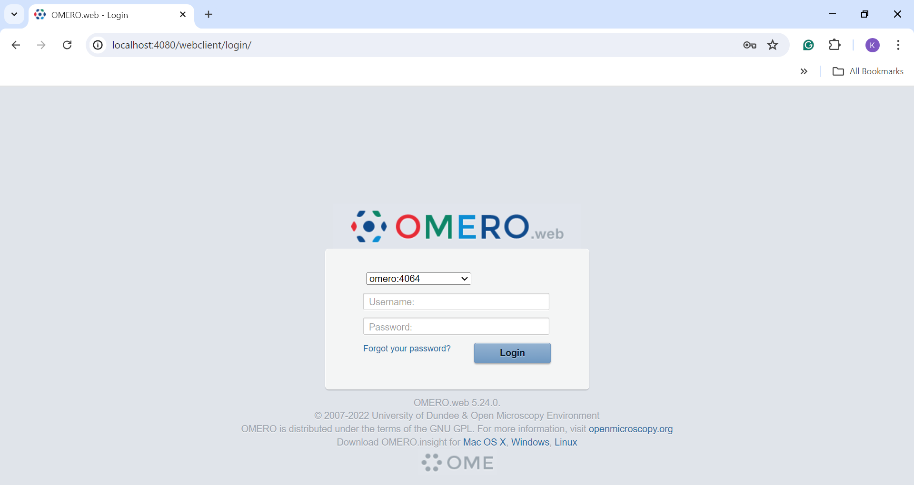
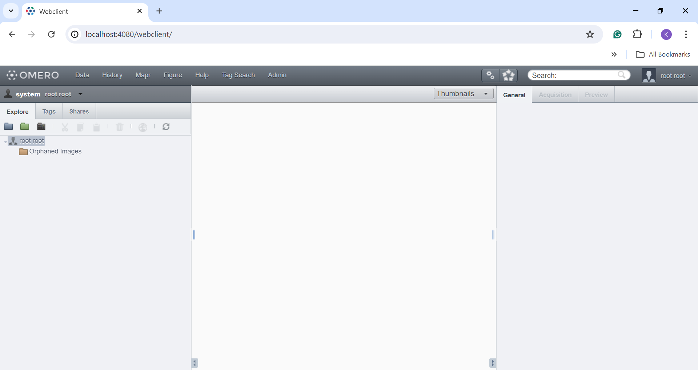
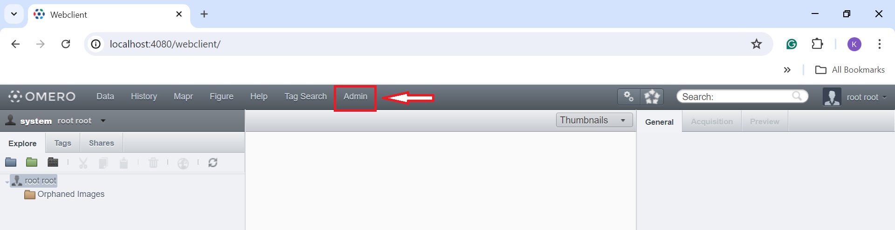

# Digital Pathology Annotation Server: OMERO Server and Web

## Contents

* [Introduction](#introduction)
* [Background](#background)
* [Manual Command Line Installation and Configuration](#manual-command-line-installation-and-configuration)
* [Docker Compsoe Installation](#docker-compose-installation)
* [Administration](#administration)
* [Import and Export images](#import-and-export-images)
* [OMERO on AWS](#omero-on-aws)
* [Future Directions](#future-directions)

-----

## Introduction

Tumor samples are routinely collected in hospitals in the course of standard diagnosis. These tissue slides are valuable data for training AI models to enhance disease detection. However, accurate annotations of tumor vs. non-tumor cells from digitized sections of stained hematoxylin and eosin (H&E) tissue remain a major challenge. To develop a classifier, it is crucial to make hundreds of gigabytes of tissue slides accessible to expert pathologists. There are several solutions for this challenge, some are commercial and others are open-source. Our approach is to deploy a digital server using OMERO, which facilitates the storage and annotations of large image datasets.   



-----

## Background



OMERO is a free and open-source microscopic image management tool. It has a ready-to-use dashboard user interface for user-friendly navigation. It has many applications and extensions to view and process images in various ways. For example, users can link QuPath and ImageJ to an OMERO server and access the images stored in the server. Users can use OMERO iviewer, figure, and fpbioimage on OMERO webclient to annotate images or generate figures. In addition to the features, can also be deployed on different OS systems easily. The following installations are performed in a Linux environment under Ubuntu 22.04. For hardware requirements for production use server, please visit [OMERO documents](https://merge-ci.openmicroscopy.org/jenkins/job/OMERO-docs/lastBuild/artifact/omero/_build/html/sysadmins/system-requirements.html).

- OMERO iviewer


- OMERO figure


-----

## Manual Command Line Installation and Configuration

This method will install OMERO Server, Web, and Command Line Interface (CLI) separately.

Detailed walkthrough installations can be found here:

- [OMERO server](local_omero_server_sop.md)

- [OMERO Web](omero_web_setup_sop.md)

- [OMERO CLI](omero_CLI_sop.md)

-----

## Docker Compose Installation

Installation of OMERO server and web using Docker Compose requires Docker installed on the local machine. If Docker is not installed, please check [Docker Desktop installation](https://docs.docker.com/desktop/) and install the version that suits the local machine system.

To set up OMERO.server and OMERO.web using docker, one way is to pull corresponding docker images (omero-server, omero-webstandalone, and postgresql) separately and then manually link them together. The other way is to create a docker compose yaml file. 

A detailed walkthrough installation using Docker Compose can be found [here](OMERO_docker_compose_sop.md).

----- 

## Administration

Once the installation is completed, one can access the OMERO web portal using their browser at `http://localhost:4080/webclient/`. 



Administrators can log in using the root user account. The root account username is `root`. If the root password values at the two locations listed below were not changed, the default password should be `omero-root`. The two locations are:

1. In the `settings.env`, use the environment variable `OMERO_ROOT_PASS`.
2. In the `docker-compsoe.yml`, in the `omeroserver` section under `services`, use the environment variable `ROOTPASS`.



- Manage groups and user accounts

    Root users or administrator users can create groups and user accounts under `Admin` tab at the top of the website.
    
    
    
    Every user must be in a group. Administrators must create groups before creating any user. There are 4 types of permissions that can be assigned to a group: Private, Read-Only, Read-Annotate, and Read-Write. Details of each type are listed below:
    
    1. Private: Data in this group is only visible to its owner and the group owner. Users in this group will not know who else is in the group. The group owner can only view the data but not edit it.
    
    2. Read-Only: Users in this group can view others' data but cannot edit data.
    
    3. Read-Annotate: Users can view and annotate others' data but cannot edit the names, projects, datasets, and tags.
    
    4. Read-Write: Users can view, edit, and delete others' data.
    
----- 
## Import and Export images

A detailed walkthrough of importing and exporting images can be found [here](import_export_sop.md).
 
-----

# OMERO on AWS

There are several ways to deploy an OMERO server and web on AWS depending on how one wants to run the server. Details can be found at [Digital Pathology on AWS](https://github.com/aws-samples/digital-pathology-on-aws?tab=readme-ov-file#omero-insight-on-appstream). 
Detailed instructions on how to launch an EC2 instance can be found [here](https://docs.aws.amazon.com/AmazonECS/latest/developerguide/launch_container_instance.html#linux-liw-initiate-instance-launch).
Instructions on how to install Docker, Docker Compose on AWS EC2 Amazon Linux 2024 instance can be found below.

To install Docker and Docker Compose, run the following commands. The installation bash script can be found [here](docker_install.sh).

```
#!/bin/bash

sudo yum update -y
sudo yum install -y docker
sudo service docker start
sudo usermod -a -G docker ec2-user
sudo curl -L "https://github.com/docker/compose/releases/latest/download/docker-compose-$(uname -s)-$(uname -m)" -o /usr/local/bin/docker-compose
sudo chmod +x /usr/local/bin/docker-compose
```

One can enter the command when launching the instance under `Advance` option or run the command on the terminal after starting the instance.

After installing Docker and Docker Compose, create a docker-compose yaml file. One can transfer files into the instance using `scp` command:

```
scp -i PEM_FILE. -r FILE_NAME USERNAME@PUBLIC_IP:LOCATION
```

Instruction on how to run Docker Compose can be found [here](OMERO_docker_compose_sop.md). 

To connect to the OMERO server, create a security group that allows port access. The ports used are listed below:

- OMERO server: 4063, 4064
- OMERO web: 80, 443, 4080

Add the security group to the instance after creating the group. In addition to the security group, one also needs to open port tunnel between their local machine and AWS. To do this, run the following command:

```
ssh -N -f -i "KEY.PEM" -L $LOCALPORT:$AWSIP:$AWSPORT ec2-user@$AWSIP
```

After opening the port, one should be able to connect to the webclient using `http://$AWSIP:4080/webclient/`.

One can also connect to an OMERO server via OMERO.insight running on Amazon AppStream 2.0. To deploy the app, follow the instructions [here](https://github.com/aws-samples/digital-pathology-on-aws?tab=readme-ov-file#omero-insight-on-appstream). This will require one's AWS account to have S3 permission.


-----

## Future Directions

Establishing a digital pathology annotation server is an important step in creating a consensus annotation of pathology slides and developing AI-based disease detection tools. We propose setting up a digital pathology annotation platform using OMERO. In the future, we plan to deploy the server on a cloud computing platform such as Amazon Web Services (AWS). By deploying the server on AWS, the server will be accessible to numerous expert pathologists outside of our network, enabling them to annotate slides collaboratively in a centralized online platform. AWS also offers scalable and secure storage for large amounts of image data. This way, we can better utilize pathology slide databases such as The Cancer Genome Atlas (TCGA) to generate consensus annotations and use the annotated slides as training data for machine learning models to develop a tumor classifier, ultimately enhancing the accuracy and reliability of pathology annotations.

-----
    
### Markdown Editor License

MIT

**Free Software, Hell Yeah!**  
