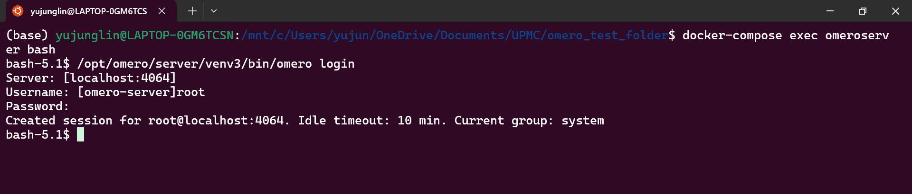
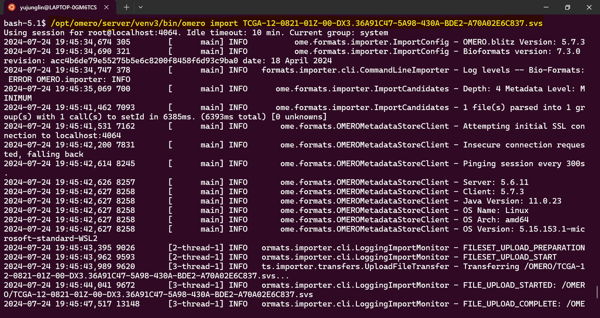
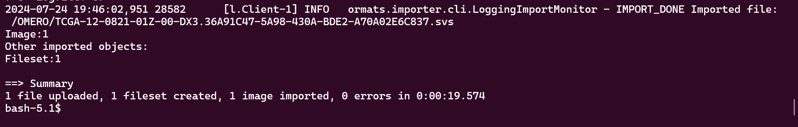
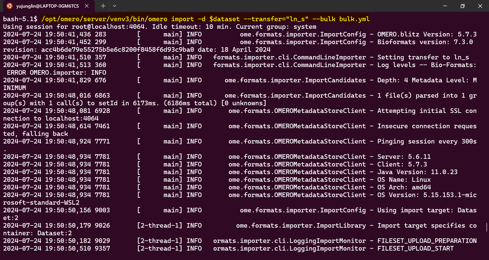
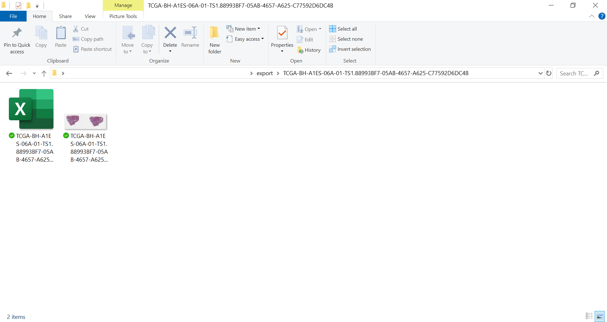

# Import and Export Images

- [Import](#import)
- [Export](#export)

-----

## Import

There are two ways to import images to OMERO server. One way is through OMERO.insight desktop application. One will connect to the server using their user account and import data. The data will be synced to the server database. The other way is importing through CLI. The process of importing using CLI is shown below.

Importing using CLI requires Java installed. If one is using the omero-server venv, Java is already installed. If Java is not installed, run the following commands to install Java:

```
apt-get update
apt-get -y install unzip wget bc
apt-get -y install cron
apt-get update -q
apt-get install -y openjdk-11-jre
```

Activate the CLI virtual environment after installing Java.
    
To access omero-server, run `omero login` and input login information such as server URL, username, and password.



- **Single image import**

    First, `cd` into the directory where the file is located. To import the file, run:
            
    ```
    omero import IMAGE_FILE_NAME
    ```
    
    Other flags options are available for different import functions. See more details using `-h, --help` or [here](https://omero.readthedocs.io/en/stable/users/cli/import.html).
    
    
    
    If the import is completed, at the end of the message, it will show 0 errors under summary.
    
    
    
- **Bulk import**

    Bulk import allows users to import multiple files or the entire directory in one command. First, create a yaml file containing the information of this import. The simplest YAML file looks like this:
        
    ```
    ---
    transfer: "ln_s" # for in-place import, can also specify in command using flag --transfer="ln_s"
    path: "bulk-files.txt"
    ```
    The example yaml file is available for download [here](import_export_files/bulk_import_files/bulk.yml).
    
    `bulk-files.txt` is a text file containing the paths to the images to be imported.
    
    Examples of `bulk-files.txt` can be downloaded from [here](import_export_files/bulk_import_files/bulk-file.txt).
    
    The bulk-import images to the server, first create a dataset where the images will be stored by running the following command:
    
    ```
    dataset=$(/opt/omero/server/venv3/bin/omero obj new Dataset name='bulk')
    ```
    
    After creating the dataset, specify the destination in bulk import command:
    
    ```
    /opt/omero/server/venv3/bin/omero import -d $dataset --transfer="ln_s" --bulk bulk.yml
    ```
    
    `--transfer="ln_s` specifies that the import is using a soft link, which does not create a copy of the imported files. However, keep in mind that, if the original file is edited or deleted, the file in the server will also be affected.
    
    
    
    Same as single import, if the process is completed without error, the summary will show 0 errors.
    
    The imported images will show up on the webclient under the dataset created.
    
    

-----

## Export

Since OMERO webclient cannot export large tiled files, one can use QuPath as the export tool.
    
First, go to `Extensions -> OMERO -> Browse server... -> New server`. Enter the URL of the OMERO server (ex. http://localhost:4080/webclient/) and then enter the OMERO account information. Next, one can select the images they want and import them into QuPath. If multiple images are selected, one needs to create a project to hold the images.

There are 2 options to export images using QuPath. One is to use the built-in export feature. The feature can be found under `File -> Export images/Export snapshot`.  
    
The other export option is to use a custom script. An example export script is shown below. The script creates an `export` folder under the project directory. In the `export` folder, a separate folder is created for each image exported. The script exports a downsampled annotated png file of the images and a geojson file containing the information of all the ROIs. One can change the value of the `downsample` variable to the value they want. The script is available to download [here](import_export_files/export_downsampled_image_roi.groovy).

To run the script, open the script editor in QuPath under `Automate -> Script editor` and open the script. To include default imports for every script, select the option under `Run -> Include default imports`. One can select if they want to run the script on one image or run the script on the entire project. The resulting folder for each image should look like this:
    



